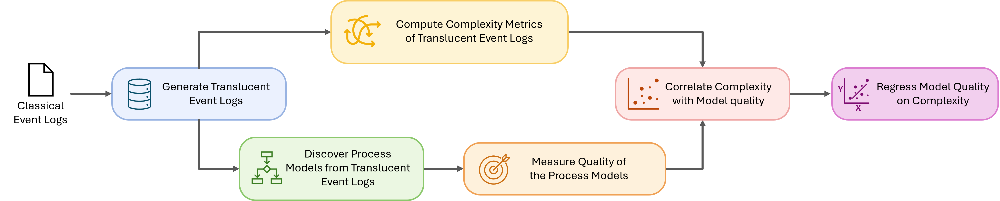

# Translucent Log Complexity

This repository contains the implementation accompanying the research paper

> **Complexity of Translucent Event Logs and their Impact on Process Discovery**
> _Submitted to the International Conference on Process Mining (ICPM 2027), research track._

In a classical event log, each event records only the activity that was executed. A **translucent event log** also records, for every event, the set of activities that were _enabled_ at that moment, i.e., the alternatives that could have been executed instead. This additional information can be exploited by translucent process discovery algorithms.

This repository provides:

- four **complexity measures** that quantify how complex the enabled-activity information of a translucent event log is, and
- an **evaluation pipeline** that relates these measures to the quality of process models discovered from the logs.

## Evaluation Pipeline



The evaluation proceeds in the following steps:

1. **Generate translucent event logs.** Starting from classical event logs, a Petri net is discovered with the Inductive Miner (noise threshold 0.4). Each trace is aligned with the model, and every event is annotated with the activities enabled in the corresponding state of the model's reachability graph. Only perfectly fitting variants are kept.
   → [`src/pipeline/generate_translucent_logs.py`](src/pipeline/generate_translucent_logs.py)

2. **Compute complexity metrics of translucent event logs.** The four measures (averge-based complexity has two variants) described [below](#complexity-measures) are computed for each translucent log and standardized (z-scores) across logs.
   → [`src/pipeline/compute_complexity.py`](src/pipeline/compute_complexity.py), [`src/pipeline/compute_dissimilarity_complexity.py`](src/pipeline/compute_dissimilarity_complexity.py)

   For comparison, three established [baseline metrics](#baseline-metrics) (variety, structure, and affinity) are computed on the same logs.
   → [`src/pipeline/compute_baseline_complexity.py`](src/pipeline/compute_baseline_complexity.py)

3. **Discover process models from translucent event logs.** For each log, Petri nets are discovered with the translucent Inductive Miner in three variants (`IMts`, `IMto`, `IMtf`), each with and without noise filtering (`IMfts`, `IMfto`, `IMftf`; default noise threshold 0.2), resulting in six models per log.
   → [`src/pipeline/discover_petri_nets.py`](src/pipeline/discover_petri_nets.py)

4. **Measure quality of the process models.** Fitness and precision (token-based replay) and their harmonic mean (F-score) are computed for each model.
   → [`src/pipeline/compute_model_quality.py`](src/pipeline/compute_model_quality.py)

5. **Correlate complexity with model quality.** The complexity measures are correlated with the model quality metrics across logs. This step can be carried out with existing statistical libraries, e.g., Kendall's τ and Pearson's r via [`scipy.stats.kendalltau`](https://docs.scipy.org/doc/scipy/reference/generated/scipy.stats.kendalltau.html) and [`scipy.stats.pearsonr`](https://docs.scipy.org/doc/scipy/reference/generated/scipy.stats.pearsonr.html).

6. **Regress model quality on complexity.** Regression models are fitted to assess how well the complexity measures explain the quality of the discovered models. Models using the translucent metrics are compared with models using the baseline metrics and with combined models using both. This step can likewise be carried out with existing libraries, e.g., multiple linear regression via [`statsmodels`](https://www.statsmodels.org/) (`OLS`), collinearity diagnostics via `statsmodels.stats.outliers_influence.variance_inflation_factor`, and leave-one-out cross-validation via [`scikit-learn`](https://scikit-learn.org/) (`LeaveOneOut`, `cross_val_predict`).

## Complexity Measures

| Dimension   | Metric                         | Variant    | Label        |
| ----------- | ------------------------------ | ---------- | ------------ |
| Scale       | Average-based Complexity       | Raw        | `avg-raw-c`  |
|             |                                | Normalized | `avg-norm-c` |
| Diversity   | Diversity-based Complexity     | -          | `div-c`      |
| Variability | Dispersion-based Complexity    | -          | `disp-c`     |
|             | Dissimilarity-based Complexity | -          | `diss-c`     |

For `diss-c`, activity distances are derived from the count-based embeddings of [Kirchmann et al.](https://github.com/henrikkirchmann/semantic-aware-process-mining-distances) using **activity-activity co-occurrence**, **sequence context**, and **PPMI post-processing**, with a context window size of 3. This corresponds to `measure_complexity(df, "dissimilarity", method="aa", ngram_size=3, bag_of_words=False)` (the defaults) and to the column `complexity_diss_aa_seq` in the pipeline output. PPMI post-processing is always applied.

### Baseline Metrics

To compare the translucent metrics with established ones, three complexity metrics for classical event logs from Augusto et al. (2022) are used, keeping the dimensions assigned to them there. They are computed from the sequences of executed activities only and ignore enabled activities.

| Dimension | Metric                               | Label       |
| --------- | ------------------------------------ | ----------- |
| Size      | Number of Event Types                | `variety`   |
| Variation | Average Distinct Events per Sequence | `structure` |
| Distance  | Average Affinity                     | `affinity`  |

- **Variety** is the number of distinct activities in the log.
- **Structure** is the average number of distinct activities per trace.
- **Affinity** is the average overlap of the directly-follows relations between pairs of traces. It is undefined (NaN) for logs with fewer than two traces.

→ [`src/baseline_complexity_measurements/baseline_complexity.py`](src/baseline_complexity_measurements/baseline_complexity.py)

## Repository Structure

```
.
|-- data/                          # Synthetic input event logs (GenEL 01-10, XES)
|-- graphs/                        # Figures (evaluation pipeline)
|-- src/
|   |-- complexity_measurements/   # Implementation of the complexity measures
|   |   |-- measure_complexity.py  # Unified entry point
|   |   |-- average_complexity.py
|   |   |-- diversity_complexity.py
|   |   |-- dispersion_complexity.py
|   |   |-- dissimilarity_complexity.py
|   |-- baseline_complexity_measurements/
|   |   |-- baseline_complexity.py     # Baseline metrics: variety, structure, affinity
|   |-- pipeline/                  # Steps of the evaluation pipeline
|       |-- generate_translucent_logs.py
|       |-- discover_petri_nets.py
|       |-- compute_model_quality.py
|       |-- compute_complexity.py
|       |-- compute_dissimilarity_complexity.py
|       |-- compute_baseline_complexity.py
|-- external/                      # Git submodules (third-party code)
    |-- TranslucentActivityRelationships/
    |-- semantic-aware-process-mining-distances/
```

## Installation

The code was developed with **Python 3.10**.

The commands below are for **Windows (PowerShell)**.

Clone the repository together with its submodules:

```powershell
git clone --recurse-submodules https://github.com/hudsonjychen/translucent-log-complexity.git
cd translucent-log-complexity
```

If you already cloned without submodules, run `git submodule update --init --recursive`.

Create a virtual environment and install the dependencies:

```powershell
python -m venv venv
venv\Scripts\Activate.ps1
pip install -r requirements.txt
```

The code of the `TranslucentActivityRelationships` submodule uses top-level imports (e.g., `utils`, `translucent_discovery`), so its root directory must be on the Python path:

```powershell
$env:PYTHONPATH = "$PWD;$PWD\external\TranslucentActivityRelationships"
```

## Usage

### Measuring the complexity of a translucent event log

The measures operate on a pandas DataFrame in the pm4py format, with enabled activities stored as a comma-separated string in the column `enabled_activities`.

```python
import pandas as pd
from src.complexity_measurements.measure_complexity import measure_complexity

df = pd.read_csv("my_translucent_log.csv")

measure_complexity(df, "average")                      # raw average
measure_complexity(df, "average", avg_type="norm")     # normalized average
measure_complexity(df, "diversity")
measure_complexity(df, "dispersion")
measure_complexity(df, "dissimilarity", method="aa", ngram_size=3, bag_of_words=False)
```

| Parameter                | Default              | Description                                                                        |
| ------------------------ | -------------------- | ---------------------------------------------------------------------------------- |
| `case_key`               | `case:concept:name`  | Case identifier column                                                             |
| `activity_key`           | `concept:name`       | Activity column                                                                    |
| `enabled_activities_key` | `enabled_activities` | Enabled activities column                                                          |
| `timestamp_key`          | `time:timestamp`     | Timestamp column (dissimilarity only)                                              |
| `avg_type`               | `raw`                | `raw` or `norm` (average only)                                                     |
| `method`                 | `aa`                 | `aa` (activity-activity) or `ac` (activity-context) (dissimilarity only)           |
| `ngram_size`             | `3`                  | Context window size: 3, 5, or 9 (dissimilarity only)                               |
| `bag_of_words`           | `False`              | Context interpretation (dissimilarity only); see the submodule for accepted values |

### Running the pipeline

The pipeline steps are designed to be run from a Jupyter notebook in the repository root:

```python
from pathlib import Path
from src.pipeline.generate_translucent_logs import generate_translucent_logs
from src.pipeline.compute_complexity import compute_complexity
from src.pipeline.compute_dissimilarity_complexity import compute_dissimilarity_complexity
from src.pipeline.compute_baseline_complexity import compute_baseline_complexity
from src.pipeline.discover_petri_nets import discover_petri_nets
from src.pipeline.compute_model_quality import compute_model_quality

paths = sorted(str(p) for p in Path("data").glob("*.xes"))

logs = generate_translucent_logs(paths)                   # Step 1
complexity = compute_complexity(logs)                     # Step 2
dissimilarity = compute_dissimilarity_complexity(logs)    # Step 2
baseline = compute_baseline_complexity(logs)              # Step 2 (baseline metrics)
models = discover_petri_nets(logs, noise_threshold=0.2)   # Step 3
quality = compute_model_quality(models)                   # Step 4

results = (
    complexity.merge(dissimilarity, on="name")
    .merge(baseline, on="name")
    .merge(quality, on="name")
)
```

`results` contains one row per log with the raw and standardized translucent and baseline complexity metrics (baseline z-scores carry the suffix `_z`) and the fitness, precision, and F-score of each discovery variant, ready for correlation and regression analysis.

## Data

The `data/` folder contains ten synthetic event logs (`GenEL 01.xes` - `GenEL 10.xes`) used as input to the pipeline. The other real-life event logs used in the evaluation is not provided in the repository. They are all openly available and can be downloaded on the internet.

## Acknowledgements

This work builds on the following repositories, included as git submodules:

- **TranslucentActivityRelationships**: translucent log generation and the translucent Inductive Miner.
  H. H. Beyel, W. M. P. van der Aalst. _Improving Process Discovery Using Translucent Activity Relationships._ BPM 2024. [DOI](https://doi.org/10.1007/978-3-031-70396-6_9)
- **semantic-aware-process-mining-distances**: count-based activity distances.
  H. Kirchmann, S. A. Fahrenkrog-Petersen, X. Lu, M. Weidlich. _Let's Simply Count: Quantifying Distributional Similarity between Activities in Event Data._ ICPM 2025. [DOI](https://doi.org/10.1109/ICPM66919.2025.11220676)
